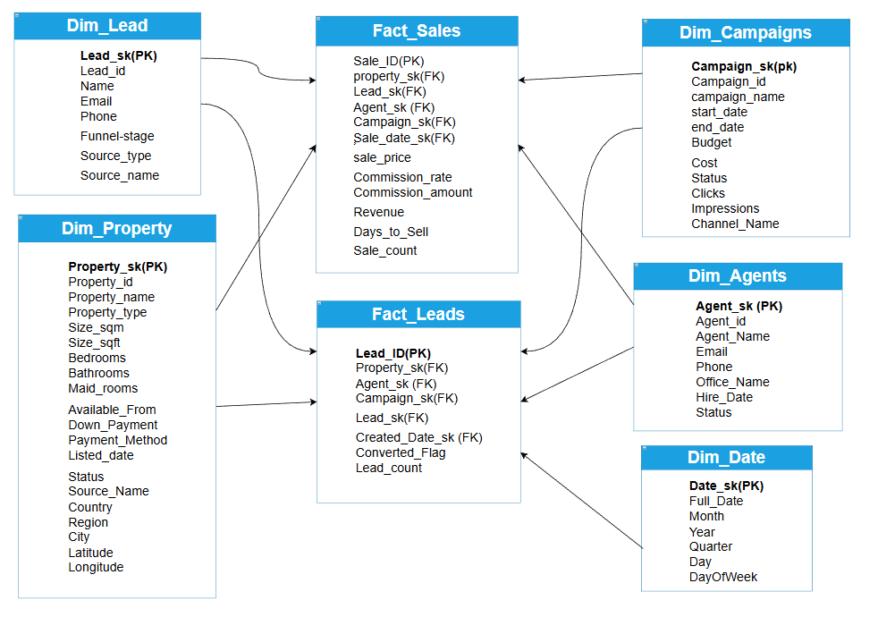

# Stages 
 - Data Collecting and Cleaning
 - Design and Create Database
 - Design and Create Data Warehouse
 - Data Analysis and Create data story telling using Tableau
 - Recommendations
# Data Colection 
   - Extract Data of listings and Properties From Property from real estate portals, specifically Property Finder and OLX.
   - Generate Data of Leads, Agents, and Campaigns Using Python code
# Database
 
# Data Warehouse
 

# Tableau 
